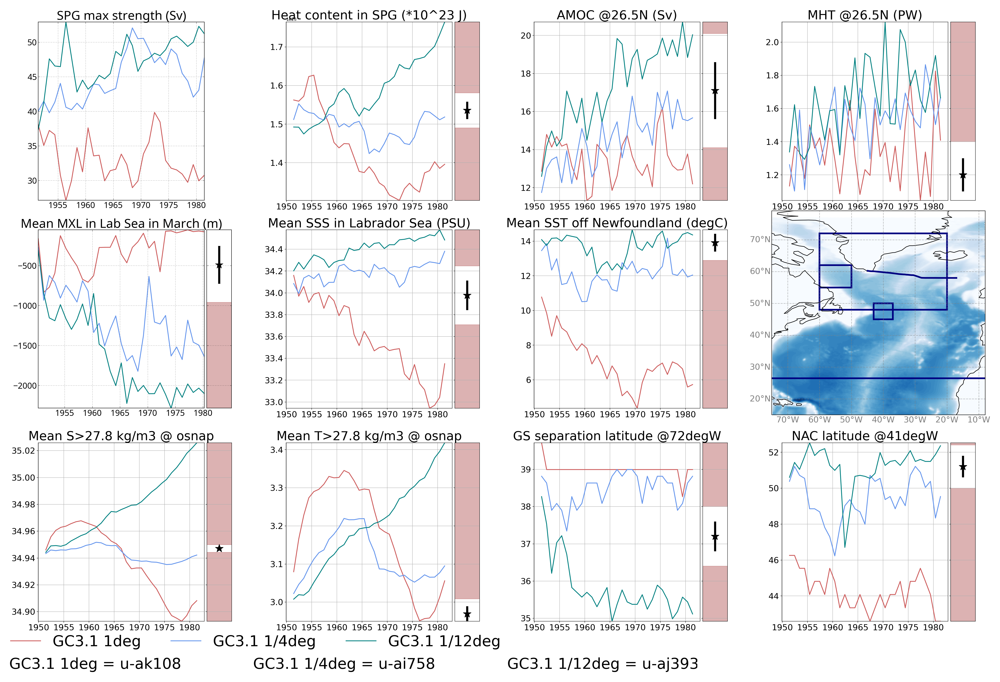
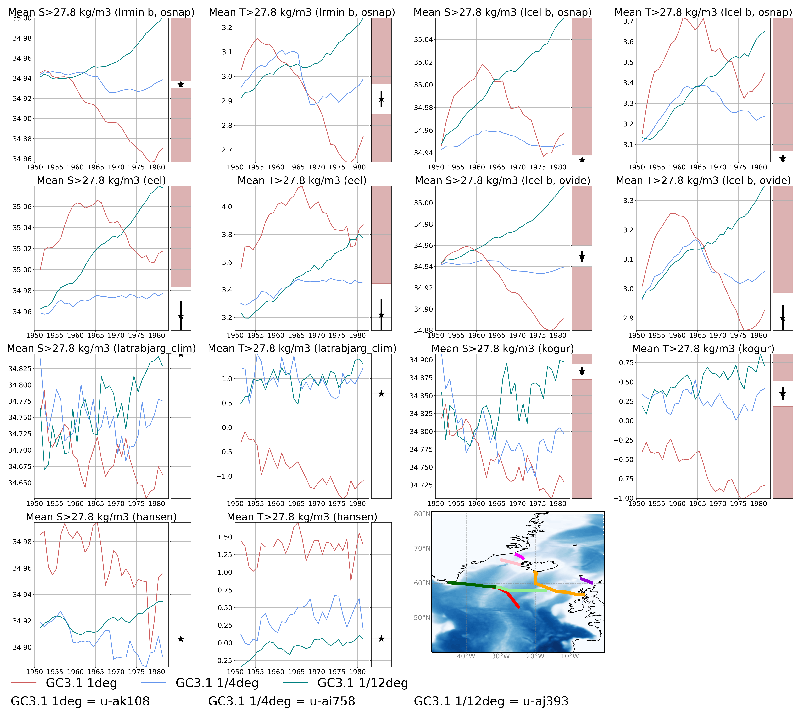

# VALNA

## Table of Contents
1. [Introduction](#introduction)
2. [Getting Started](#getting_started)
3. [How to run](#howtorun)
4. [File Structure](#files)
5. [Output](#output)
6. [Authors](#authors)
7. [Licence](#licence)
8. [Acknowledgements](#acknowledgement)

<a name="introduction"></a>
## Introduction

A software package for ocean scientists to calculate and plot the following evaluation metrics to compare North Atlantic ocean biases between CMIP models
  with a NEMO ocean:

   * Subpolar gyre strength (Sv)
   * Subpolar gyre heat content (J) 
   * AMOC at 26.5N at max. depth (Sv)
   * OHT at 26.5N (PW)
   * Mixed layer depth in Labrador Sea in March (m)
   * Mean SSS anomaly in Labrador Sea (PSU)
   * Mean SST anomaly off Newfoundland (degC)
   * Mean overflow bottom temperature (degC) and salinity (PSU) below the 27.8 isopycnal at various locations. Currently, VALNA isolates 
     and averages the Irminger and Icelandic basins at the osnap observational cross-section.
   * GS separation latitude (degN)
   * NA current latitude (degN)

<a name="getting_started"></a>
## Getting Started

* Copy the VALNA directory and create and activate the conda environment. 

```
   git clone git@github.com:JMMP-Group/VALNA.git
   
   cd VALNA

   conda env create -f valna.yml
   
   conda activate valna
   
```
* Note the `nordic-seas-validation` package needs
to be installed locally as following.

```
   git clone https://github.com/JMMP-Group/nordic-seas-validation.git

   cd nordic-seas-validation
   
   pip install -e .
   
   python -c "import nsv"
```

* Download CDFTOOLs_4.0 toolbox and compile it as following (or use compiled verision in VALNA directory)

```
   git clone https://github.com/meom-group/CDFTOOLS

   cd src/

   ln -sf ../Macrolib/macro.MACHINE make.macro
```
In the make.macro file, the PATH for the netcdf library is specified, as well as compiler name and used flags. In order to activate netcdf4/HDF5 chunking and deflation ( available in some cdftools), you need to set:
```
   NC4=-Dkey_netcdf4
```
in the make.macro file, otherwise set
```
   NC4=
```
In order to activate CMIP6 variable naming convention (for input files), you need to set:
```
   CMIP6=-Dkey_CMIP6
```

* Edit `param.bash` to fit your setup/need
   * mesh mask location with mesh mask name
   * location of the CDFTOOLS toolbox
   * where to store the data output (or link to existing data location) 
    
<a name="howtorun"></a>
## How to run
 * To retrieve the data from MASS and calculate the metrics using CDFtools and Python (metrics to calculate are 
   specified in `param.bash`, otherwise all are calculated) :
  
```
./run_all.bash [CONFIG] [YEARB] [YEARE] [FREQ] [RUNID list]
```
For example:
```
./run_all.bash ORCA025 1950 1980 1y u-ak108 u-ai758
```

Note the `CONFIG` is used for the mesh_mask file and is either `ORCA1`, `ORCA025` or `ORCA12`.
Define the line colour and linestyle for each simulation using `style.db`. The code currently uses `style_6_initial.db`.
Instead of annual averages, to select monthly averages, set `FREQ` to `1m`.

 * To plot the time series of the VALNA metrics:
```
./run_plot_VALNA.bash [KEY] [FREQ] [RUNID list]
```
For example:
```
./run_plot_VALNA.bash ORCA1_025_test 1y u-ak108 u-ai758
```


 * To plot the overflow metric time series only at various locations, plot:

```
./run_plot_ovf_only_VALNA.bash [KEY] [FREQ] [RUNID list]
```

 * In addition in the SCRIPT directory, there are jupyter notebooks to plot spatial maps and overflow cross sections, if 
   useful.

<a name="files"></a>
## File Structure

~~~~~~~
VALNA
      |-- FIGURES
            |-- 
      |-- OBS
            |-- 
      |-- SCRIPT
            |-- SUPPLEM_PLOTS
                  |-- obs_data_cal_mean_std.ipynb
                  |-- plot_GS_sep_NAC_SST_SSS_maps.ipynb
                  |-- plot_overflow_Xsection.ipynb
                  |-- plot_valna_ovf_maps.ipynb            
            |-- cal_GS_sep_NAC_lat.py
            |-- cal_ovf_metric.py
            |-- common.bash
            |-- get_data.bash
            |-- mk_gsl_nac.bash
            |-- mk_htc.bash
            |-- mk_mht.bash
            |-- mk_moc.bash
            |-- mk_mxl.bash
            |-- mk_ovf.bash
            |-- mk_psi.bash
            |-- mk_sss.bash
            |-- mk_sst.bash
            |-- plot_time_series.py
      |-- ORIG_STYLE_FILES
            |-- 
      |-- LICENSE
      |-- param.bash
      |-- README.md
      |-- requirements.txt
      |-- run_all.bash
      |-- run_plot_ovf_only_VALNA.bash
      |-- run_plot_VALNA.bash
      |-- style.db
      |-- style_6_initial.db
      |-- valna.yml
~~~~~~~


<a name="output"></a>
## Output
 * All individual time series are saved in the FIGURES directory with txt file describing the specific command line to 
   build it.
 * The single figure with all the metrics, and a map of the locations used for averaging, is outputted in the main 
   directory. The observed mean and 1 standard deviation is displayed via the error bar (outside 2 standard deviations 
   is highlighted in red). An example is shown below:



A repeat for the overflow metrics only, at various locations, is shown below:



<a name="authors"></a>
## Authors
* [sophmm](https://github.com/sophmm)

<a name="licence"></a>
## Licence

[comment]: <> ([![License: MIT]&#40;https://img.shields.io/badge/License-MIT-yellow.svg&#41;]&#40;https://opensource.org/licenses/MIT&#41;)

<a name="acknowledgement"></a>
## Acknowledgements
* Based on VALSO (Southern Ocean evaluation metrics) by Pierre Mathiot
* Pre-processing software for the overflow observational data is from: https://github.com/JMMP-Group/nordic-seas-validation
