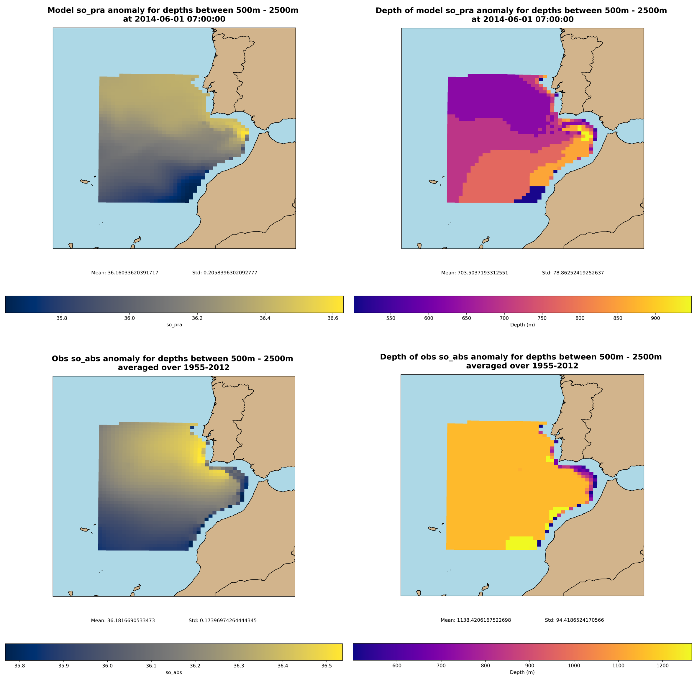
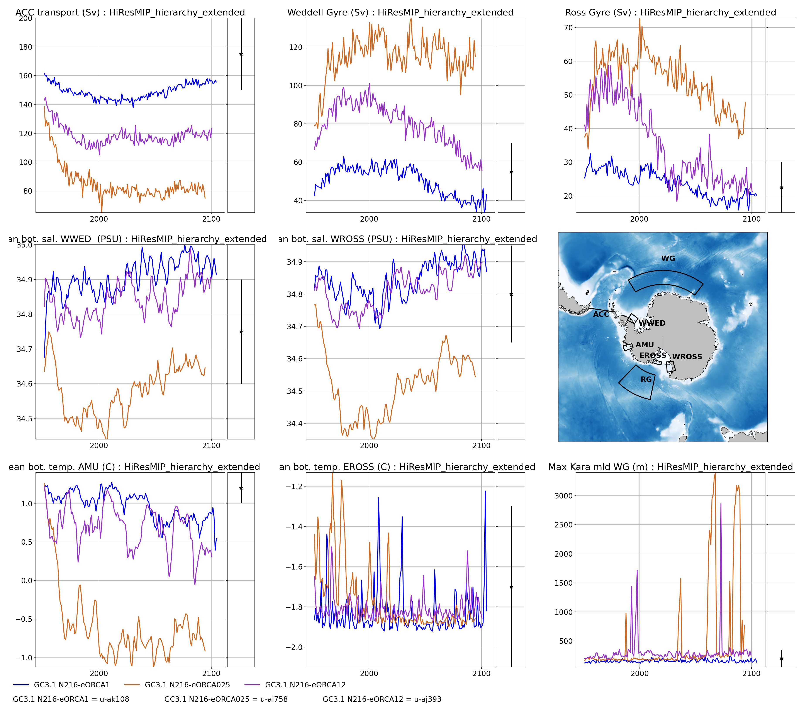

# Statement of Need
Numerical ocean general circulation models (OGCMs) are routinely run at increasingly high spatial and temporal resolutions, resulting in simulations that are both computationally demanding and generate vast amounts of data. As a consequence, extracting meaningful oceanographic metrics from these outputs has become more complex and time-consuming, presenting significant challenges for researchers and impeding the pace of model development. MARINE_VAL was developed to address these issues by providing a streamlined and standardised approach for model evaluation.

# Summary
MARINE_VAL is an open-source command-line software package developed for researchers to streamline the evaluation of OGCM outputs. By standardising the calculation and visualisation of scalar evaluation metrics, it enables direct comparison with observational datasets, while also fostering reproducibility and comparability across studies. Although MARINE_VAL is primarily tailored for NEMO [@nemo] outputs across a range of resolutions, its flexible design allows for straightforward adaptation to other structured grid models. The package integrates CDFTOOLS [@cdftoolsJMMP] and xarray [@hoyer2017xarray] to deliver efficient and scalable data processing, ultimately facilitating quicker model development and analysis.

# Features
## Diagnostic Computation
MARINE_VAL computes a comprehensive set of diagnostics, organised into three principal metric groups: Southern Ocean assessment (VALSO), North Atlantic assessment (VALNA), and straits transports/exchanges (VALTRANS). Users have the flexibility to select any combination of metrics to suit their specific research needs by editing the user configuration file `param.bash`. The package is designed to harness SLURM [@SLURM] and HPC parallel processing for efficient job execution and data retrieval from archive systems, while also offering the flexibility to bypass data retrieval through the user configuration file to use locally stored model data. If a user wants to use an alternative data archive system to MASS, then `get_data.bash` will need to be adapted accordingly.

**VALSO** (Southern Ocean assessment):
Provides metrics for evaluating the strength and variability of major Southern Ocean currents and water masses, such as the Antarctic Circumpolar Current, regional gyres, shelf water properties, and deep water formation.

**VALNA** (North Atlantic assessment):
Focuses on diagnostics relevant to North Atlantic circulation, such as subpolar gyre strength, heat and salt content, overturning circulation, mixed layer depth, and key regional anomalies and profiles.

**VALTRANS** (Straits transports and exchanges):
Assesses the transport and exchange of water masses through major straits and passages, including deep overflows, marginal sea exchanges, and inter-basin throughflows.

ACTION: Add to, or remove the table?

| Diagnostic | Description |
|-:|:---|
| Census of Antarctic Bottom Water | $\displaystyle{\sigma_4 > 45.88}$, where $\displaystyle{\sigma_4 = \rho(S, \Theta, 4000 \text{ dbar}) - 1000 \text{ kg/m}^3}$ |

## Visualisation
MARINE_VAL features automated plotting scripts that produce standardised figures for each diagnostic package. In addition, specific processes can generate geospatial plots that visualise aggregated vertical data, such as sums, means, or anomalies, across the analysis regions. Users have control over the appearance of these figures, with options to customise labels, colors, and line styles through the style configuration file `style.db`. 

### A geospatial example: The Mediterannean Overflow
One practical application of MARINE_VAL is its ability to seamlessly produce scatter plots of temperature, salinity, and model bathymetry in the analysis regions, as seen in Figure \autoref{fig:MEDOVF}. These outputs can help researchers assess the realism of their simulations and identify areas for model improvement.

### A temporal example: VALSO
Another practical application of MARINE_VAL is regionally grouped model evaluation. For instance, researchers can use MARINE_VAL to calculate key Southern Ocean diagnostics relating to its circulation, temperature, salinity and density in key regions, and visualise them together on one set of plots, all using one command.  

To perform such an analysis, users will have already configured and calculated the required diagnostics. The plotting script collates the scalar metrics over the calculated time period for each diagnostic, and produces a set of time-series plots, as seen in Figure \autoref{fig:VALSO_TS}. The results can be directly compared to published observational values, seen in the accompanying distribution to the right of each plot.

# Relation to ongoing research projects
ACTION: Update for a set of past or ongoing research projects using the software?

MARINE_VAL is part of ongoing efforts to improve the accessibility and evaluation of large ocean model datasets. The package builds on community-developed tools and supports collaborative research in ocean model development a evaluation.

# Acknowledgments
This is the Met Office development of the original VALSO code by Pierre Mathiot. The package acknowledges contributions from the ocean modeling community and support from collaborating institutions. Further acknowledgements and references are provided in the README.

# References
